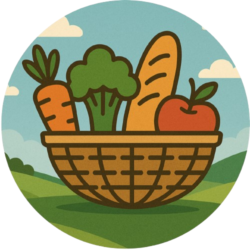
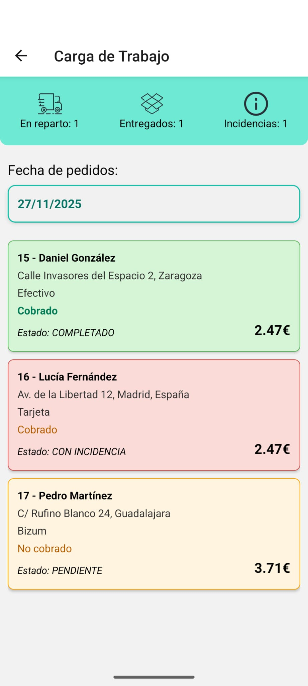
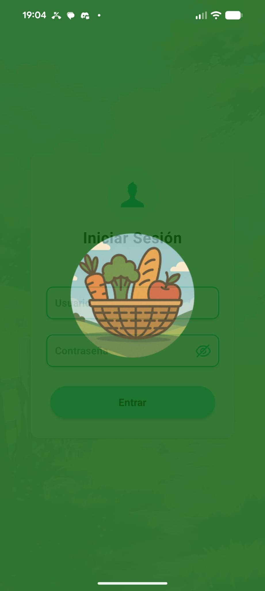
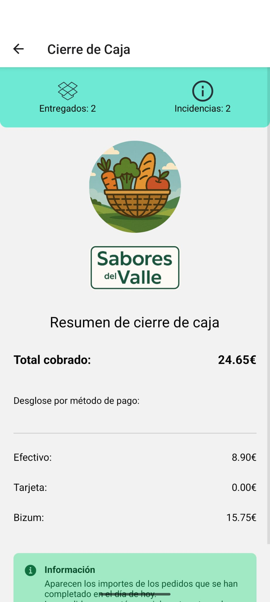

    
    <h1>🍝 Sabores del Valle 🍗</h1>

 

    

 

**Gestión de pedidos y caja para tiendas (e-commerce) directamente en tu dispositivo.**

Sabores del Valle es una aplicación móvil diseñada para facilitar la gestión de pedidos, seguimiento de entregas y cierre de caja de forma rápida y eficiente.

## ✨ Características principales
- 🍽️ Gestión de pedidos en tiempo real.
- 🛒 Seguimiento de pedidos en reparto y entregados.
- 💰 Cierre de caja diario con desglose por métodos de pago.
- 📊 Estadísticas y resumen de pedidos por estado.
- 🗓️ Filtrado de pedidos por fecha y control de incidencias.

 

    

 

## 💻 Tecnologías utilizadas
- 🟦 **React Native / TypeScript / Expo** (Para construir la aplicación móvil)
- ⚛️ **Expo Router** (Para la navegación entre pantallas)
- 🗄️ **SQLite** (Para almacenamiento local de pedidos y usuarios)
- 🎨 **CSS** (Para estilos y diseño de UI)

 
 
 
 

## 🌐 Repositorio del proyecto
Puedes consultar el código fuente y seguir su desarrollo aquí:

👉 **[Ver repositorio en GitHub](https://github.com/HuGymsForMe/Sabores-del-Valle)**

## 📱 Descarga de la APK

La versión actual 1.1.0 de **Sabores del Valle** está disponible **solo para Android**, tanto para **móviles como para tablets**.  

👉 **[Descargar APK de la versión actual](https://expo.dev/accounts/hugymsforme/projects/sabores-del-valle/builds/13ec2524-00ab-4562-89ee-68fa9f67de21)**  

 

    

 

**¡Gestiona tu tienda desde la palma de tu mano con Sabores del Valle!**
